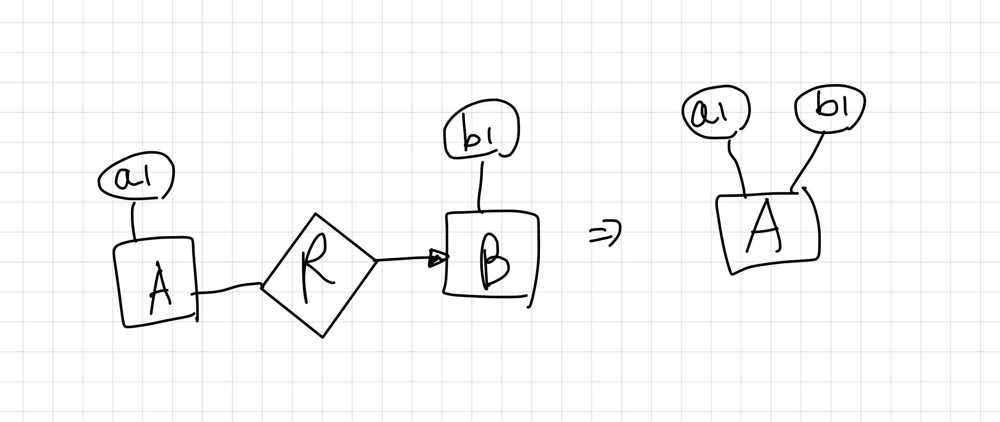

# E/R Data Model

## 데이터베이스 모델링 개요

- 데이터베이스 모델링과 구현 과정

    1. 착상 (머릿속으로 생각하기)
    2. Entity-Relationship Model 설계 (개념적 설계)
    3. Relation Schema (구현 설계)
    4. RDBMS
    

- 데이터베이스 설계 시 가장 먼저 해야 할 일
    - 데이터베이스가 어떤 정보를 다루어야 하는지
    - 정보 요소들 간의 관계성은 어떻게 되는지에 대해 분석

- Data Model
    - Data 사이 관계를 기술하는 개념적 도구
    - Database의 논리적 구조

- Entity-Relationship Model
    - `Diagram 표기법`으로 Graphical하게 모델을 표현
        - Entity: `사각형`
            - `유사한 엔티티`(객체)들의 집합
            - OOP 관점에서 `Class`와 유사 (But 구조만 가져가고 연산은 X)
        - Attribute: `원형`
            - `엔티티들의 특성, 속성`
            - 문자열, 상수, 실수 ... Atomic Value
        - Relationship: `다이아몬드`
            - 둘 이상 엔티티 집합들간의 연결
    - `E/R 관계성`
        - Many to Many
        - Many to One (One to Many)
        - One to One
    - `E/R Degree`
        - 하나의 관계로 연결된 Entity의 개수
        - 가장 흔한 차수는 binary (2)
        - Multiway Relationship: 3차 이상
 
##

    [Example]. Studio가 제작하는 Movie에 출연하는 Star와의 계약

- ##
    - Relationship Role
        - 관계 타입의 의미를 명확하게 하기 위해 사용
        - 특히, 한 Entity 집합이 한 Relationship에서 두 번 이상 사용 가능
        - Relation 타입의 간선 위에 표시

## 설계 원칙

- Attribute가 되는 바람직한 조건 (해당 조건을 모두 만족하면, Entity를 Attribute로 대치 가능)
    - E(Entity)와 관련된 R(Relationship)은 모두 E로부터 One to Many
        - Many to Many일 때 Attribute일 경우, 다중값 발생
    - E에 있는 모든 Attribute는 상호 독립적
        - 정보의 중복 배제
    - E가 두 번 이상 참가하는 R은 없음
        - Attribute로 할 경우, 관계성 정보가 유실
    

## Constraint Modeling

- `Constraint`
    - `Key`: Entity를 유일하게 구별할 수 있는 Attribute (여러 개도 가능)
        - 표현 시, Attribute 이름에 밑줄
        - E/R Model에서 두 개 이상의 Key를 표기하는 방법은 제공X (주석으로 처리 등)
    - `Singlue-value Constraint`: 많아야 하나의 값만 가질 수 있는 제약조건
    - `Referential Integrity Constraint`: 참조무결성 제약조건
        - 어떤 다른 객체에 의해 참조되는 값이 반드시 Database에 존재해야 한다.
        - ex. 영화는 무조건 하나의 스튜디오에 꼭 소유되어야 한다.
        - 둥근 화살표 사용
        - 참조 무결성이 지켜지도록 하기 위한 방법
            - 참조되는 객체의 삭제를 금지
            - 참조되는 객체가 삭제되면, 이 객체를 참조하고 있던 모든 객체도 같이 삭제
    - `Domain Constraint`: Attribute의 값이 특정 값의 집합에 속해야 한다.
        - ex. length는 0~240 사이여야 한다.
        - ex2. length는 integer type이다.
        - E/R Model에서 도메인제약을 위한 특별한 표기법은 없다. (Attribute 아래에 따로 표시)
    - `General Constraint`: 임의의 무결성 assertion
        - ex. 한 편의 영화에는 스타가 10명 이하만 나열되어야 한다.
        - edge에 숫자를 기입하는 방식?
            - 화살표는 <= 1 ([화살표: 최대 1개] 연결 or 비연결)
            - 둥근 화살표는 = 1 ([화살표: 최대 1개] [둥근: 참조무결성] 무조건 연결)
