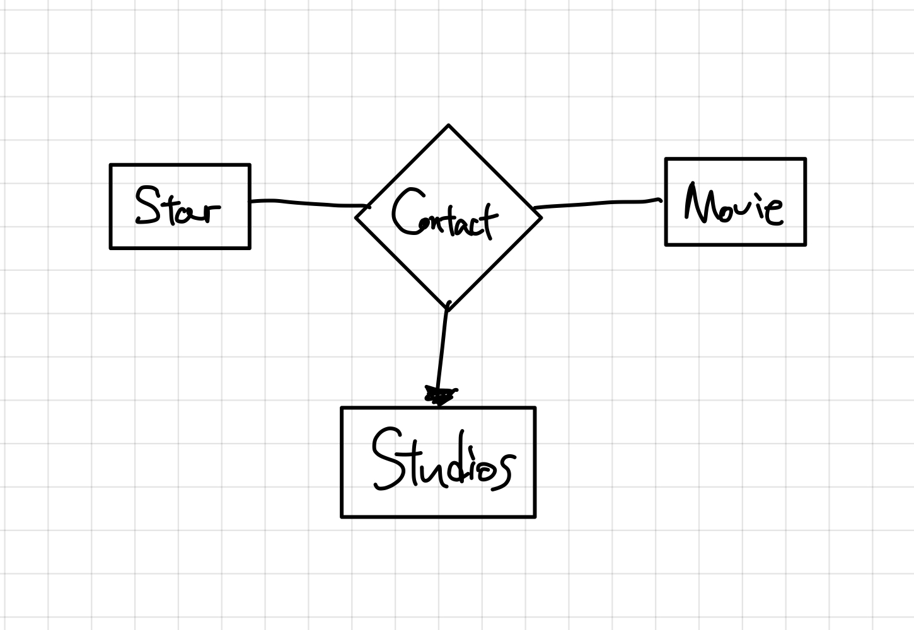
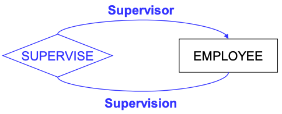

# E/R Data Model

## 데이터베이스 모델링 개요

- 데이터베이스 모델링과 구현 과정

    1. 착상 (머릿속으로 생각하기)
    2. Entity-Relationship Model 설계 (개념적 설계)
    3. Relation Schema (구현 설계)
    4. RDBMS
    

- 데이터베이스 설계 시 가장 먼저 해야 할 일
    - 데이터베이스가 어떤 정보를 다루어야 하는지
    - 정보 요소들 간의 관계성은 어떻게 되는지에 대해 분석

- Data Model
    - Data 사이 관계를 기술하는 개념적 도구
    - Database의 논리적 구조

- Entity-Relationship Model
    - `Diagram 표기법`으로 Graphical하게 모델을 표현
        - Entity: `사각형`
            - `유사한 엔티티`(객체)들의 집합
            - OOP 관점에서 `Class`와 유사 (But 구조만 가져가고 연산은 X)
        - Attribute: `원형`
            - `엔티티들의 특성, 속성`
            - 문자열, 상수, 실수 ... Atomic Value
        - Relationship: `다이아몬드`
            - 둘 이상 엔티티 집합들간의 연결
    - `E/R 관계성`
        - Many to Many
        - Many to One (One to Many)
        - One to One
    - `E/R Degree`
        - 하나의 관계로 연결된 Entity의 개수
        - 가장 흔한 차수는 binary (2)
        - Multiway Relationship: 3차 이상
 
##

    [Example]. Studio가 제작하는 Movie에 출연하는 Star와의 계약

- ##
    - Relationship Role
        - 관계 타입의 의미를 명확하게 하기 위해 사용
        - 특히, 한 Entity 집합이 한 Relationship에서 두 번 이상 사용 가능
        - Relation 타입의 간선 위에 표시

